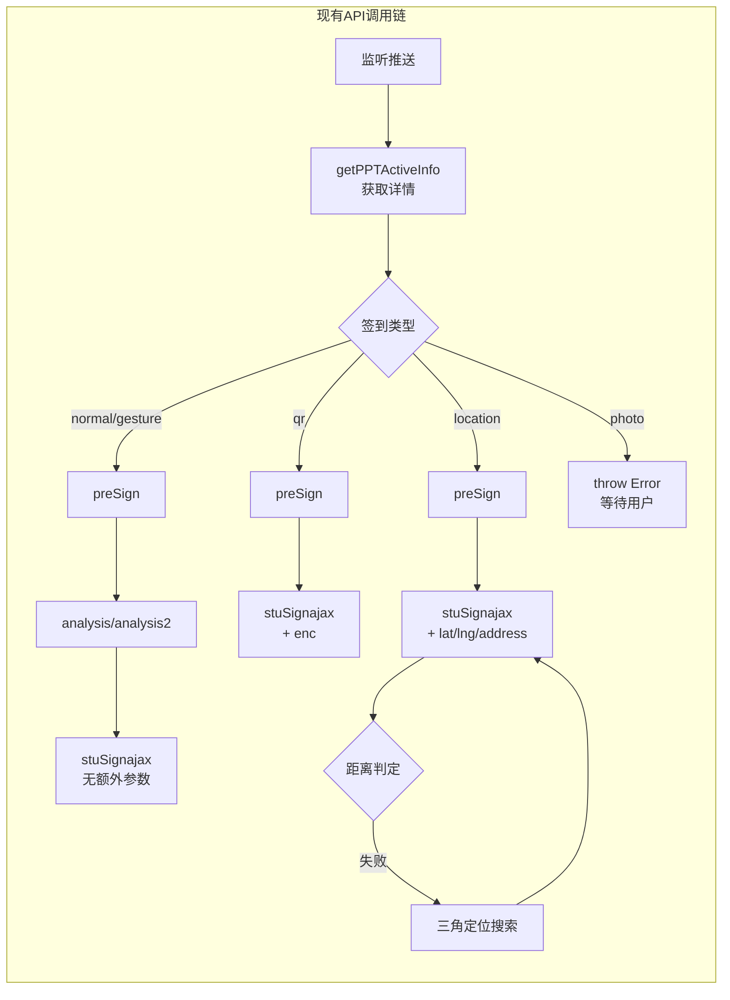
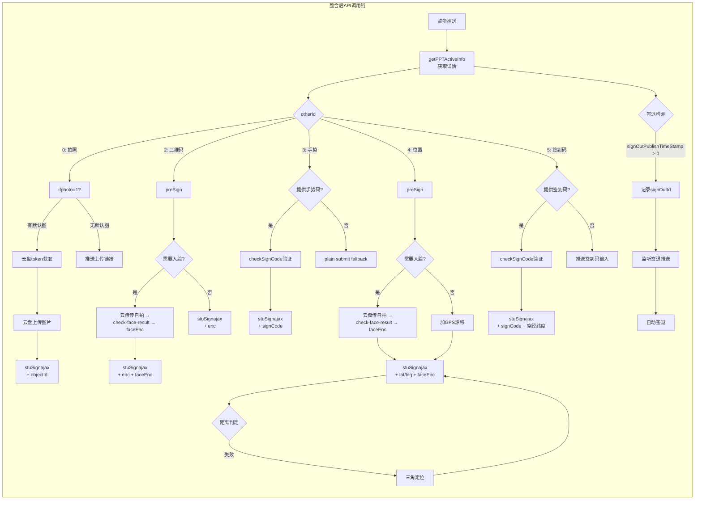
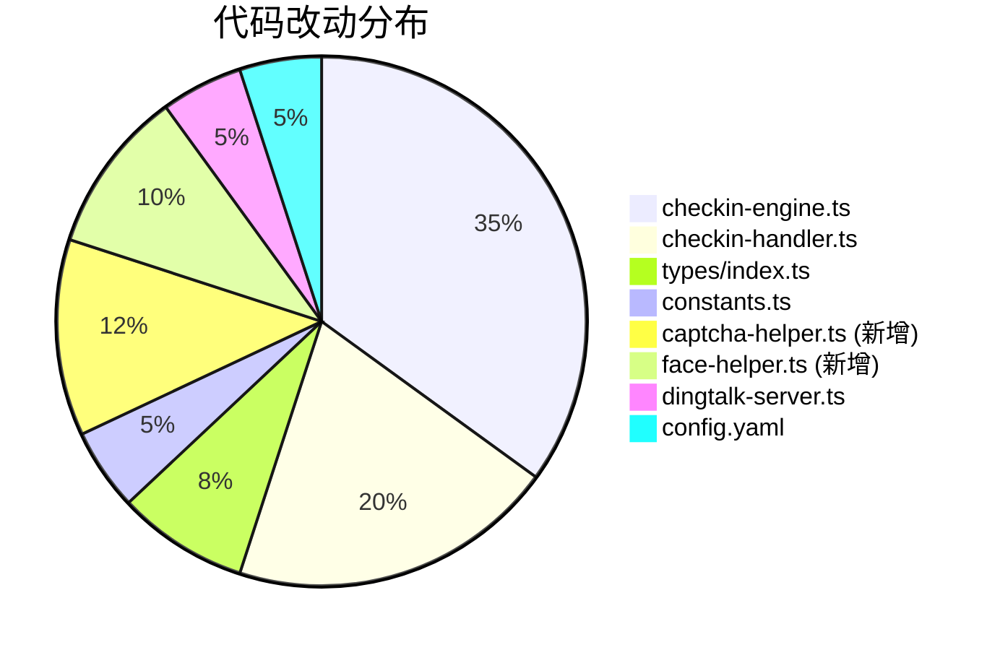
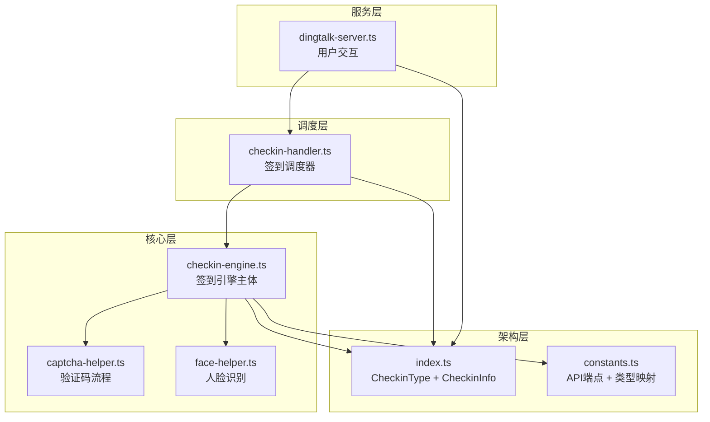

# 整合前后对比图

## 1. 签到类型支持对比

```mermaid
gantt
    title 签到类型支持情况对比
    dateFormat  YYYY-MM-DD
    axisFormat  %m-%d
    
    section 整合前
    普通签到          :done, a1, 2026-07-01, 30d
    位置签到          :done, a2, 2026-07-01, 30d
    二维码签到        :done, a3, 2026-07-01, 30d
    手势签到(plain)   :crit, a4, 2026-07-01, 30d
    拍照签到(阻塞)    :crit, a5, 2026-07-01, 30d
    签到码签到(缺失)  :crit, a6, 2026-07-01, 30d
    
    section 整合后
    普通签到          :done, b1, 2026-07-01, 30d
    位置签到          :done, b2, 2026-07-01, 30d
    二维码签到        :done, b3, 2026-07-01, 30d
    手势签到(验证)    :active, b4, 2026-07-15, 15d
    拍照签到(自动)    :active, b5, 2026-07-15, 15d
    签到码签到        :active, b6, 2026-07-15, 15d
    签退检测          :active, b7, 2026-07-20, 10d
    验证码处理        :planned, b8, 2026-07-25, 10d
    人脸识别          :planned, b9, 2026-07-25, 10d
```

---

## 2. API 调用流程对比

### 现有系统（整合前）



### 整合后（ChaoxingSignFaker 方案合并）



---

## 3. 功能维度对比矩阵

| 功能维度 | 整合前 | 整合后 | 改进关键 |
|---------|--------|--------|---------|
| **签到检测** | `success` / `签到成功` 统一字符串 | 每类型独立 `checkAlreadySign()` 精确匹配 | 避免误判 |
| **手势签到** | plain submit 无参数 | `checkSignCode` 验证 + `signCode` 参数 | 成功率提升 |
| **签到码签到** | ❌ 不存在 | ✅ 完整流程 | 新增类型 |
| **拍照签到** | handler 抛异常等待用户 | 自动用默认照片提交 | 可用性大幅提升 |
| **验证码处理** | ❌ 遇到 `validate` 放弃 | 滑块验证码 + 重试带 `validate` | 被动防封 |
| **人脸识别** | ❌ 不支持 | `check-face-result` + `signToken` + `faceEnc` | 通过率提升 |
| **签退检测** | ❌ 不支持 | `signOutPublishTimeStamp` 监听 | 完整签到闭环 |
| **活动信息** | 仅 `otherId` | 完整提取：`signInId`, `signOutId`, `ifNeedVCode`, `openCheckFaceFlag`, `numberCount` | 精细决策 |
| **签到过期** | 不检测 | `checkExpiredSign("下次早点哦")` | 提前告知 |
| **已签到** | 不检测 | `checkAlreadySign` 精确区分"已签"和"未签" | 避免重复签到 |
| **preSign** | GET 无 body | GET + `ext` 字段 | 更完整的状态标记 |

---

## 4. 代码改动量估算



---

## 5. 文件依赖关系（整合后）



---

> **图表示例**：以上图表使用 Mermaid 语法。在 GitHub/GitLab/Mermaid 编辑器/VSCode 中可以渲染查看。每个图表可在 https://mermaid.live 中直接预览。
